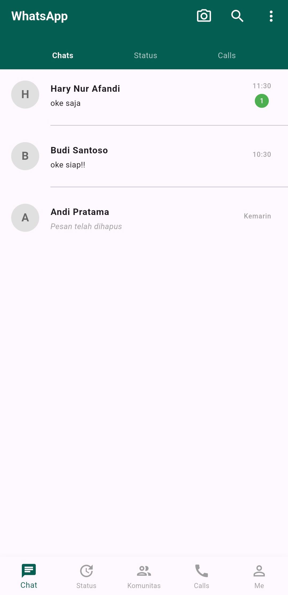

# Tugas UI/UX Flutter - WhatsApp UI

## Identitas
- **Nama:** Hary Nur Afandi
- **NIM:** 2455201110004
- **Pilihan:** A

## Deskripsi Singkat
Aplikasi ini adalah hasil replikasi dan modifikasi antarmuka (UI) dari aplikasi WhatsApp. Aplikasi ini dibuat dalam satu project utuh yang terdiri dari 2 halaman utama:
1. **Halaman Chat List (Daftar Chat):** Menampilkan daftar obrolan kontak, status pesan terakhir, waktu, serta indikator pesan yang belum dibaca (unread message).
2. **Halaman Chat Room (Detail Percakapan):** Menampilkan riwayat gelembung percakapan (chat bubble) secara detail beserta input field teks di bagian bawah.

## Widget yang Digunakan
- **Scaffold:** Sebagai struktur dasar halaman materi UI.
- **AppBar:** Membuat bar bagian atas aplikasi yang memuat judul dan tombol aksi.
- **TabBar / Row:** Menyusun navigasi menu Chats, Status, dan Calls di bawah AppBar.
- **ListView.separated & ListView.builder:** Menampilkan daftar chat secara dinamis dan efisien sesuai standar modul kuliah halaman 5.
- **ListTile:** Komponen terpadu untuk menyusun avatar (leading), nama & pesan (title/subtitle), dan waktu (trailing) pada daftar chat.
- **CircleAvatar:** Membuat lingkaran foto profil/inisial huruf nama kontak serta badge unread chat.
- **Divider:** Garis pembatas antar kontak dengan konfigurasi indentasi khusus.
- **BottomNavigationBar:** Menu navigasi utama di bagian bawah layar.
- **TextField:** Kolom input untuk mengetikkan pesan di ruang obrolan.

## Screenshot

## Wireframe

## Kesulitan yang Ditemui
Kesulitan awal yang ditemui adalah menyelaraskan teks jam (time) berdampingan secara horizontal dengan ikon centang dua status pengiriman di dalam gelembung pesan tanpa merusak fleksibilitas teks utama. Masalah ini berhasil diselesaikan dengan menerapkan widget `Row` yang diatur dengan parameter `mainAxisSize: MainAxisSize.min` sehingga ukuran komponen gelembung chat tetap fleksibel dan tidak menyebabkan error overflow layout.