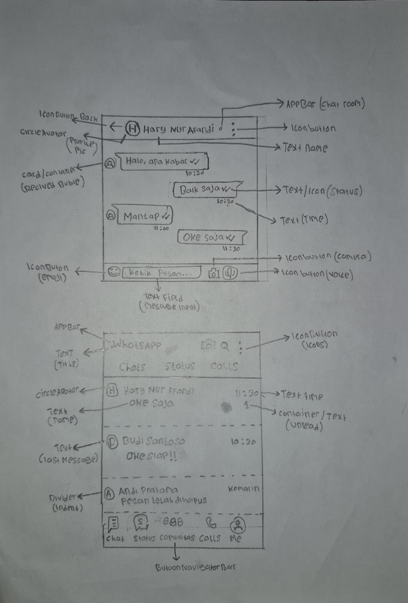

# Tugas UI/UX Flutter - WhatsApp

## Identitas
- **Nama:** Hary Nur Afandi
- **NIM:** 12291620000
- **Pilihan:** A

## Deskripsi Singkat
Aplikasi ini merupakan hasil klon (*cloning*) antarmuka aplikasi WhatsApp yang terdiri dari dua halaman utama sesuai ketentuan tugas, yaitu:
1. **Halaman Chat List:** Berfungsi menampilkan daftar seluruh obrolan/pesan masuk dari beberapa kontak, lengkap dengan indikator pesan belum dibaca (*unread message*).
2. **Halaman Chat Room:** Berfungsi menampilkan ruang percakapan secara detail dengan kontak terpilih (Hary Nur Afandi) beserta riwayat gelembung pesan (*chat bubble*).

## Widget yang Digunakan
- `Scaffold` - Sebagai struktur dasar halaman yang menyediakan tempat untuk AppBar dan Body.
- `AppBar` - Sebagai bar bagian atas untuk menampilkan judul aplikasi (WhatsApp) maupun nama kontak beserta tombol aksi.
- `TabBar` - Sebagai menu navigasi berbasis tab di bawah AppBar untuk memisahkan menu Chats, Status, dan Calls.
- `ListView.separated` - Untuk membuat daftar kontak di Chat List dan daftar gelembung pesan di Chat Room agar rapi dengan pembatas.
- `ListTile` - Untuk menyusun komponen setiap baris kontak (foto, nama, sub-teks pesan, dan waktu) agar sejajar dengan mudah.
- `CircleAvatar` - Untuk menampilkan foto profil kontak dalam bentuk lingkaran.
- `Divider` - Sebagai garis pembatas antar-kontak di halaman Chat List.
- `BottomNavigationBar` - Sebagai bar menu navigasi utama yang terletak di bagian paling bawah halaman.
- `TextField` - Digunakan di bagian bawah Chat Room sebagai kolom input tempat mengetik pesan.
- `IconButton` - Untuk membuat tombol berbentuk ikon seperti tombol kembali, kamera, pencarian, panggilan, dan kirim pesan.

## Screenshot

## Wireframe

## Kesulitan yang Ditemui
Pada awalnya sempat menemui kendala dalam memahami cara memecah komponen desain visual (*decomposition*) menjadi susunan kode widget Flutter, terutama dalam memisahkan elemen jam teks dan ikon centang status pesan yang posisinya berdampingan horizontal. Namun kendala tersebut berhasil diatasi dengan menggunakan widget `Row` untuk menggabungkan `Text` jam dan widget `Icon` centang di dalam satu baris.